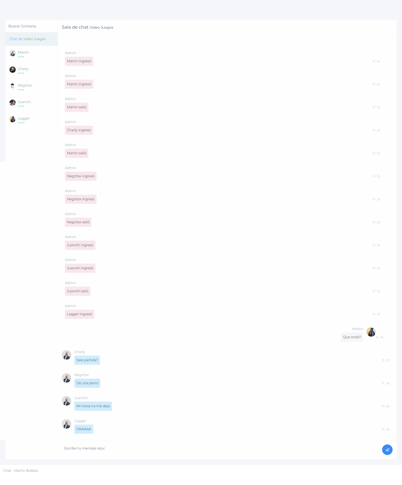

<h1 align="center">
   
  
    
  Aplicación de teatros
   
</h1>

# Descripción
Gestión de teatros, shows, presentaciones, reservas. Tambien autenticacion propia, facebook y google. El servidor está implementado con Firebase

# Capturas

### Inicio

### Chat

